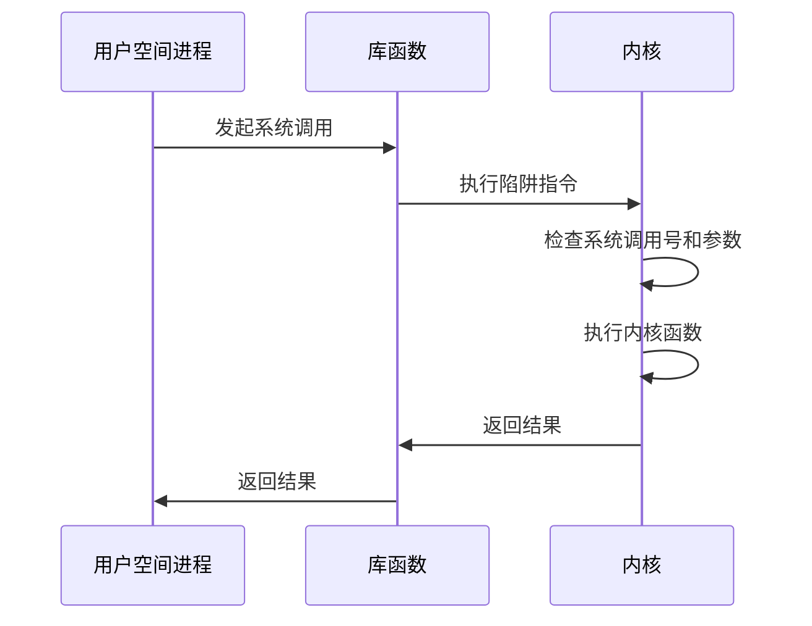
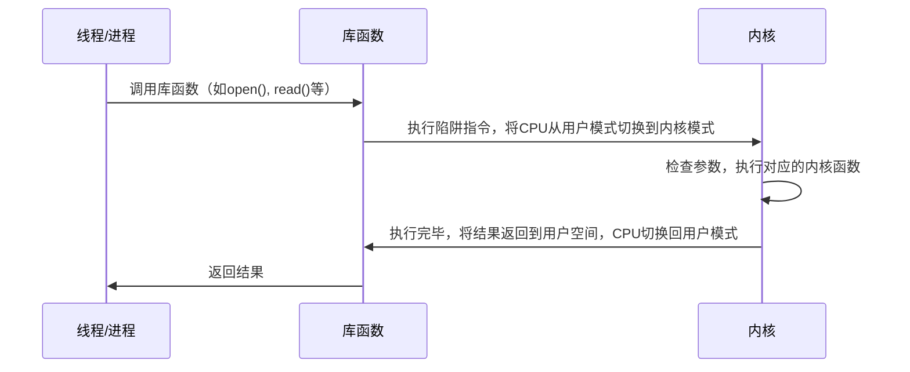

---
{"dg-publish":true,"permalink":"/card/操作系统/操作系统-内核态与用户态/","tags":["aigc"],"noteIcon":"2","created":"2021-04-08T17:05:52+08:00","updated":"2024-10-21T16:56:43+08:00"}
---

# 操作系统-内核态与用户态

**System**: You are a helpful AI assistant.

**User**: 请说明linux操作系统的系统调用过程的全过程，并配上必要的mermaid图解

**Assistant**: 在Linux操作系统中，系统调用是用户空间进程与内核空间通交流的主要方式。以下是系统调用过程的全过程：

1. 用户空间进程通过库函数发起系统调用。这些库函数通常是glibc库中的封装函数，如`open()`, `read()`, `write()`等。这些函数内部实际上是通过使用特定的系统调用号和参数来发起系统调用的。

2. 库函数将系统调用号和参数放入适当的寄存器，然后执行一个特殊的陷阱指令（如`int 0x80`或`syscall`）。这个指令将CPU从用户模式切换到内核模式，并跳转到内核中预定义的固定地址开始执行。

3. 内核检查系统调用号和参数的有效性，然后找到对应的内核函数并执行。

4. 内核函数执行完毕后，将返回结果放入一个寄存器，然后执行一个特殊的指令（如`iret`）来将CPU从内核模式切换回用户模式，并跳回到库函数。

5. 库函数从寄存器取出返回结果，然后返回给用户空间进程。

以下是对应的mermaid图解：

这个图解描述了用户空间进程、库函数和内核之间在系统调用过程中的交互。

**User**: 从进程或者线程的角度看系统调用是怎样的

**Assistant**: 从进程或线程的角度来看，系统调用可以被视为一个函数调用。进程或线程通过调用特定的库函数（如`open()`, `read()`, `write()`等）来发起系统调用。然而，与普通的函数调用不同，系统调用涉及到用户空间和内核空间之间的切换。

当进程或线程发起系统调用时，它将被挂起，直到系统调用完成。此时，CPU从用户模式切换到内核模式，开始执行内核中的代码。这种模式切换是必要的，因为内核空间可以访问硬件和所有系统资源，而用户空间的访问权限则被严格限制。

系统调用完成后，结果会被返回到用户空间，CPU模式切换回用户模式，进程或线程继续执行。

因此，即使系统调用看起来像一个简单的函数调用，但它实际上涉及到了许多复杂的步骤，包括模式切换、权限检查、参数验证等。

以下是对应的mermaid图解：

这个图解描述了线程/进程、库函数和内核之间在系统调用过程中的交互。

**User**: 进程做完系统调用操作之后，处理系统调用的进程还是原来的进程吗？

**Assistant**: 是的，处理系统调用的仍然是原来的进程。当一个进程发起系统调用时，它并没有改变，也没有被替换或转换。相反，它只是暂时地切换到了内核模式，以便内核可以代表它执行特定的操作，如读取文件、打开网络连接等。

在系统调用完成后，控制权将返回到原来的进程，进程将继续从系统调用返回点开始执行。因此，尽管系统调用涉及到用户空间和内核空间之间的上下文切换，但发起系统调用的进程始终保持不变。

这也是为什么系统调用常常被描述为"昂贵"或"耗时"的操作，因为涉及到上下文切换和模式切换，这些都是需要消耗处理器时间的操作。但是，这是必要的，因为它使得用户空间的进程能够安全地访问硬件和系统资源，而不需要关心底层的细节。

**User**: 为什么有的地方说是先通过软中断陷入系统内核，然后由内核线程执行系统调用，然后再返回给用户线程？

**Assistant**: 首先，我们需要理解这里的"软中断"和"内核线程"。

软中断（也被称为软件中断或陷阱）是一种 CPU 指令，它会引发 CPU 切换到内核模式并开始执行内核代码。这就是进程如何发起系统调用的：它通过执行一个软中断指令（如 int 0x80 或 syscall），将 CPU 从用户模式切换到内核模式，并跳转到内核中的预定义地址开始执行。

内核线程是内核的一部分，它在内核空间中运行，并且可以访问所有的系统资源和硬件。当进程发起系统调用时，实际上是由内核线程来完成这个调用的。内核线程会检查系统调用的参数、执行相应的内核函数，然后将结果返回给用户空间。

所以，当我们说"通过软中断陷入系统内核，然后由内核线程执行系统调用，然后再返回给用户线程"，其实是这样的过程：

1. 用户线程（或进程）通过执行一个软中断指令，发起一个系统调用。

2. CPU 切换到内核模式，开始执行内核代码。

3. 内核线程接管，检查系统调用的参数、执行相应的内核函数。

4. 内核线程执行完毕，将结果返回给用户空间。

5. CPU 切换回用户模式，用户线程（或进程）继续执行。

这就是为什么有的地方会说是通过软中断陷入系统内核，然后由内核线程执行系统调用，然后再返回给用户线程。这个表述可能会让人误解为系统调用是由另一个线程来完成的，但实际上是由同一个进程（只不过是在内核模式下）来完成的。

**User**: 但是你上文所说的：【当一个进程发起系统调用时，它并没有改变，也没有被替换或转换。相反，它只是暂时地切换到了内核模式，以便内核可以代表它执行特定的操作，如读取文件、打开网络连接等。】  和现在说的需要一个内核线程执行，不是自相矛盾的吗？

**Assistant**: 对不起，让我们来澄清一下。当我们说“内核线程执行系统调用”时，实际上是指在内核模式下的原始进程（或线程）。

在大多数情况下，当一个用户进程发起一个系统调用时，该进程会切换到内核模式并继续执行。在这种情况下，我们可以将其视为“内核线程”，因为它现在正在执行内核代码，尽管它实际上仍然是原始的用户进程。

所以，当我们说“内核线程执行系统调用”时，我们实际上是指原始的用户进程，但现在它正在内核模式下执行。

这是一个复杂的概念，因为它涉及到操作系统的用户模式和内核模式之间的切换，以及用户进程和内核线程之间的区别。我希望这个解释能够帮助你理解。再次对之前可能造成的混淆表示歉意。

总结：
当然，让我们总结一下关于Linux系统调用和进程在用户空间和内核空间之间交互的讨论：

1. **系统调用概念**：系统调用是用户空间进程请求操作系统内核提供服务的机制。这些服务包括文件操作、进程控制、网络通信等。
2. **发起系统调用**：用户进程通过库函数（如C标准库中的封装函数）发起系统调用。这些库函数将系统调用号和参数放入适当的寄存器，并执行一个特殊的软中断指令（如`int 0x80`或`syscall`）来触发系统调用。
3. **用户模式和内核模式**：当软中断指令执行时，CPU从用户模式（低权限模式）切换到内核模式（高权限模式），这样进程就可以安全地执行需要更高权限的操作。
4. **内核处理**：在内核模式下，操作系统内核接管，验证系统调用参数，执行相应的内核服务，并将结果准备好返回。
5. **返回用户空间**：一旦内核完成了系统调用请求的处理，它将结果放入寄存器，并将控制权返回给用户空间进程，同时将CPU模式切换回用户模式。
6. **进程和内核线程**：执行系统调用的实际上还是原始的用户进程，只是它现在以内核模式运行。它在执行系统调用期间，可以认为是一个“内核线程”，但这并不意味着它是一个完全独立的线程实体。一旦系统调用完成，原始的用户进程将继续在用户空间执行。这里的“内核线程”描述并不意味着有一个新的、独立的线程被创建来处理系统调用。
7. **概念澄清**：在前面的对话中，使用“内核线程执行系统调用”这样的表述可能会导致理解上的混淆。为了澄清，执行系统调用的是在内核模式下运行的用户进程本身，而不是一个单独的内核线程实体。

希望这次的总结能够更加清晰地阐述了Linux系统调用的全过程，以及进程在用户模式和内核模式之间切换的概念。

# Reference

[Does each system call create a process?](https://stackoverflow.com/questions/57124847/does-each-system-call-create-a-process)

	No, they don't. The operating system uses software interrupt to execute the system call operation within the same process. You can imagine them as a function call but they are executed with kernel privileges.
	不，它们不是。操作系统使用软件中断在同一进程内执行系统调用操作。你可以将它们想象为函数调用，但它们是以内核特权执行的。

[Based on the difference between select poll epoll](https://ofstack.com/C++/8673/based-on-the-difference-between-select--poll--epoll.html)
